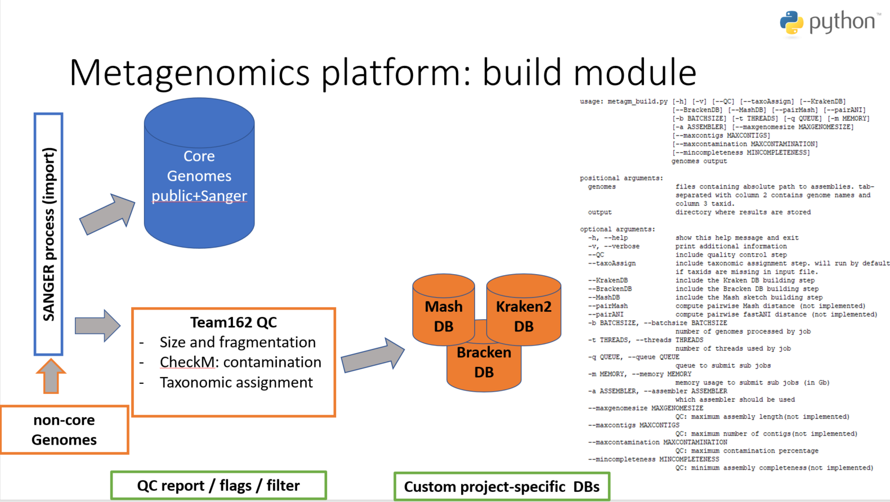
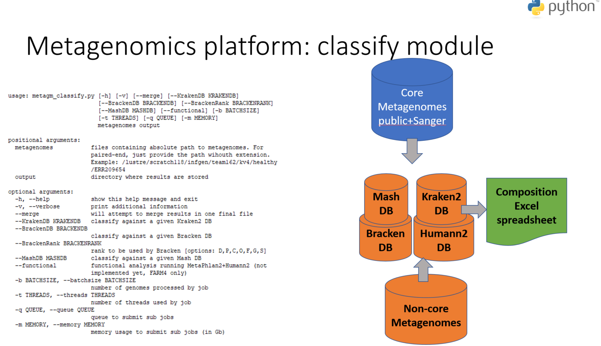
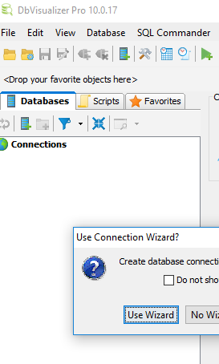
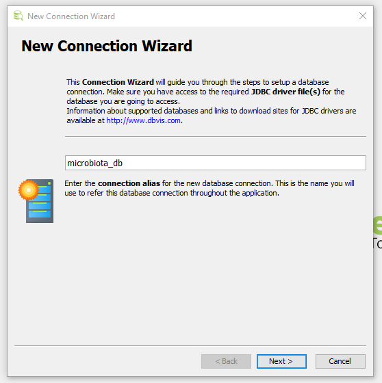
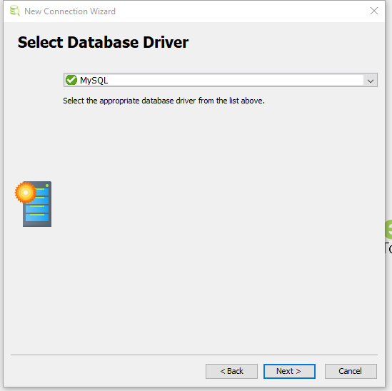
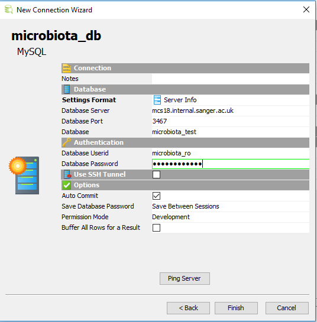
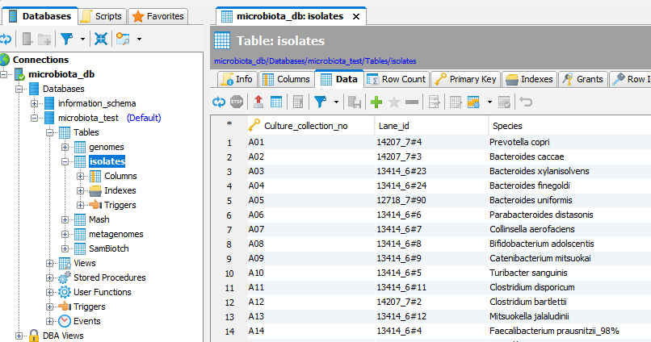

# metagm: the metagenomic platform from Team162

In this page, we provide examples illustrating the different options offered by the platform.

## Before starting

* Currently, __it is preferable to run the scripts on `farm3`__, as there is no large memory queue elsewhere (especially `metagm_build`).
* __To use all the scripts described in this page, users need to add__ the following to their `~/.profile` file:

```
# add the metagm library to your path
export PATH=/nfs/team162/kv4/github/metagm/metagm/wrapper:$PATH
```
and then run the command `source ~/.profile`

## metagm_build module

This section describes the process of building databases for different softwares (Kraken, Bracken, Mash, ...) using a list of reference genomes. It also takes care of submitting all the jobs on farm and manage job dependencies.



### Inputs (mandatory)
There is two mandatory positional arguments for this function:
* a `genomes` list (text file):
  * __mandatory__ first column contains the absolute paths to genome assemblies (`.fa` or `.fna`)
  * second column contains the genome names (if not provided, the file name will be used)
  * third column contains the taxids (if not provided, a [taxonomic assignment](https://github.com/kevinVervier/metagm/blob/master/README.md#taxonomic-assignment) step is performed) 
* an `output` folder to store all the files produced by the script

### Options
The script `metagm_build.py` also offers options in the building database process:
* `-h`: help display
* `-v`: verbose mode for additional details on each step
* `--QC`: run [quality control](https://github.com/kevinVervier/metagm/blob/master/README.md#quality-control) on the list of genomes before building any database. If not done, the scirpt assumes that all the genomes have already been cheked.
* `--taxoAssign`: run [taxonomic assignment](https://github.com/kevinVervier/metagm/blob/master/README.md#taxonomic-assignment) step on all the genomes. It will automatically be done if Kraken/Bracken databases are built.
* `--KrakenDB`: build a Kraken2 database using the list of genomes
* `--BrackenDB`: build a Bracken database using the list of genomes. Requires a Kraken database to exist, and will therefore automatically creates one.
* `--MashDB`: create a [Mash sketch](https://mash.readthedocs.io/en/latest/sketches.html) of all the genomes.
* `--ncbi`: rely on NCBI taxonomy instead of gtdb (_default: false_)
* `-b`: define the number of genomes to be analyzed in each batch (_default: 10_)
* `-t`: define the number of threads used in each job (_default: 2_)
* `-q`: define to which queue the jobs are submitted (_default: long_)
* `-m`: define the amount of memory requested for each job (_default: 64_)
* `--maxcontamination`: define the maximal value on checkm contamination to filter out a genome during QC (_default: 5_)
* `--mincompleteness`: define the minimal value on checkm completeness to filter out a genome during QC (_default: 90_)

### Outputs

The `output` folder contains a directory for each task that is performed:
* `output/merge_final` contains quality control (QC) results for all the genomes
  * `output/merge_final/ValidatedGenomes.txt` is the list of all genomes that pass QC
  * `output/merge_final/FilteredGenomes.txt` is the list of all genomes that fail QC
  * `output/merge_final/log.txt` provides details on why a genome failed QC
* `output/tmp$i` folders contain the [checkm lineage_wf](https://github.com/Ecogenomics/CheckM/wiki/Workflows#lineage-specific-workflow) output for the batch `i` of genomes (if parallelized)
* `output/Kraken` contains the [Kraken2 database](https://ccb.jhu.edu/software/kraken2/index.shtml?t=manual#kraken-2-databases), as well as the [Bracken files](https://github.com/jenniferlu717/Bracken#step-1-generate-the-bracken-database-file-databasexmerskmer_distrib) (if requested)
* `output/Mash` contains the [Mash sketch](https://mash.readthedocs.io/en/latest/sketches.html) file
* `output/genome_with_[gtdb|ncbi]_taxid.txt` contains the list of taxids assigned to the genomes list if a [taxonomic assignment](https://github.com/kevinVervier/metagm/blob/master/README.md#taxonomic-assignment) step is performed

### Examples

The following examples illustrate various features from the `metagm_build.py` script. Depending how busy _farm_ is, these examples can take some time to run.

#### Quality control + taxonomic assignment on a list of genomes

```
metagm_build.py /nfs/team162/kv4/bin/list_example_pipeline.txt ./test --QC --taxoAssign -m 100
```

The command applies:
1. [Quality control](https://github.com/kevinVervier/metagm/blob/master/README.md#quality-control) on 13 genomes.
 * according to `./merge_final/ValidatedGenomes.txt`, there is XYZ genomes that passed QC
 * according to `./merge_final/FilteredGenomes.txt`, there is XYZ genomes that failed QC
 * according to `./merge_final/log.txt`, the genomes were filtered because of XYZ
2. [taxonomic assignment](https://github.com/kevinVervier/metagm/blob/master/README.md#taxonomic-assignment) on validated genomes only, using GTDB taxonomy (default).
 * the taxonomic assignment can be found in `./genome_with_gtdb_taxid.txt`
3. The [taxonomic assignment](https://github.com/kevinVervier/metagm/blob/master/README.md#taxonomic-assignment) step is high in memory requirement (~100Gb). 
 
 #### Quality control + taxonomic assignment on a list of genomes (faster)

This example achieves the same task than [previously](https://github.com/kevinVervier/metagm/blob/master/README.md#quality-control--taxonomic-assignment-on-a-list-of-genomes), except it takes advantage of job parallelization. Better than running jobs on 10 genomes at a time (2 jobs in previous example), we now do batches of 2 genomes (`-b` flag), therefore submitting 7 smaller jobs.

```
#delete previous example folder
rm -rf ./test
# run the faster command
metagm_build.py /nfs/team162/kv4/bin/list_example_pipeline.txt ./test --QC --taxoAssign -m 100 -b 2
```

#### Kraken/Bracken database on a list of validated genomes

It is possible to skip the quality control and directly create Kraken database if user already checked the genomes. Additionally, the taxonomic assignment step can be ignored if user provides a taxid for each genome (third column in input list). Here, we use the curated genome list generated in the previous [example](https://github.com/kevinVervier/metagm/blob/master/README.md#quality-control--taxonomic-assignment-on-a-list-of-genomes). 

```
#Run on a queue with 'hugemem' (e.g., farm3)
metagm_build.py ./genome_with_gtdb_taxid.txt ./test --KrakenDB --BrackenDB
```
The command builds:
1. [Kraken2 database](https://ccb.jhu.edu/software/kraken2/index.shtml?t=manual#kraken-2-databases) on XYZ genomes using GTDB taxonomy.
 * generate multiple files described in [Kraken2 manual](http://ccb.jhu.edu/software/kraken2/index.shtml?t=manual#kraken-2-databases)
2. [Bracken files](https://github.com/jenniferlu717/Bracken#step-1-generate-the-bracken-database-file-databasexmerskmer_distrib).
 * generate multiple files described in [Bracken manual](https://github.com/jenniferlu717/Bracken#step-1-generate-the-bracken-database-file-databasexmerskmer_distrib)

### Comments

* You can access all the information in the command help `metagm_build.py -h `
* Building a Kraken database might require a large memory amount (>200Gb). The function will automatically submit the final `kraken_build` job on `hugemem` queue which means users need to run it on farm3 (or farm4/5 when this queue will be available).
* If neither `--QC`, `--Kraken`, `--Bracken`, or `--Mash` is provided, the `metagm_build.py` is not going to do anything.
* The [taxonomic assignment](https://github.com/kevinVervier/metagm/blob/master/README.md#taxonomic-assignment) step is high in memory requirement (~100Gb).

## metagm_classify module

This section describes the process of classifying metagenomics sequencing reads to get both taxonomic and functional profiles. It also takes care of submitting all the jobs on farm and manage job dependencies.



### Inputs (mandatory)
There is two mandatory positional arguments for this function:
* a `metagenomes` list (one-column text file):
  * __paired-end data__: only provide path without extension, like `/lustre/scratch118/infgen/team162/kv4/healthy/ERR209654`. The script will automatically seek for `/lustre/scratch118/infgen/team162/kv4/healthy/ERR209654_1.fastq.gz` and `/lustre/scratch118/infgen/team162/kv4/healthy/ERR209654_2.fastq.gz`.
  * __single-end data__: provide whole path to `fastq` files
  * the script will __automatically detect if data are gzipped__
* an `output` folder to store all the results produced by the script

### Options
The script `metagm_classify.py` offers software options for classification:
* `-h`: help display
* `-v`: verbose mode for additional details on each step
* `--KrakenDB`: path to a Kraken2 database folder (example: `/nfs/pathogen005/team162/Kraken0419_kraken2_taxo_resolved`)
* `--BrackenDB`: path to a Kraken2 database folder with Bracken files in it (example: `/nfs/pathogen005/team162/Kraken0419_kraken2_taxo_resolved`)
* `--BrackenRank`: taxonomic rank for Bracken output (_default: S_ for species) [options: D,P,C,O,F,G,S]
* `--MashDB`: path to a `.msh` Mash sketch (example `/nfs/pathogen005/team162/RefSeq94n.msh`)
* `--functional`: run a [functional characterization](https://github.com/kevinVervier/metagm/blob/master/README.md#functional-analysis-of-metagenomes) of the metagenomes rather than a taxonomic one (_default: false_)
* `--noMetaPhlan`: skip `MetaPhlan2` step in [functional analysis](https://github.com/kevinVervier/metagm/blob/master/README.md#functional-analysis-of-metagenomes) (_default: false_). will only work if these files already exist.
* `-b`: define the number of metagenomes to be analyzed in each batch (_default: 10_)
* `-t`: define the number of threads used in each job (_default: 2_)
* `-q`: define to which queue the jobs are submitted (_default: long_)
* `-m`: define the amount of memory requested for each job (_default: 64_)
* `--merge`: will automatically merge all the output files from one method in a single table file (_default: true_)
   * for `Kraken`, it relies on the `/nfs/team162/kv4/Kraken2Table.pl` script to generate two merged tables: a raw count and a normalized abundance
  * for `Bracken`, it relies on the [`combine_bracken_outputs.py`](https://github.com/jenniferlu717/Bracken/blob/master/analysis_scripts/combine_bracken_outputs.py) script to generate a single table mixing raw and relative abundance
   * for `Mash`, it relies on the `/nfs/team162/kv4/bin/parse_mash.R` script to report high-confidence hits for each sample
   * for `functional` analysis, data will always be merged in tables at different levels (gene families, pathways, GO categories, ...)

### Outputs
The `output` folder contains a directory for each task that is performed:
* `output/Kraken` contains the [Kraken2 report](https://ccb.jhu.edu/software/kraken2/index.shtml?t=manual#sample-report-output-format) 
* `output/Bracken` contains the [Bracken files](https://github.com/jenniferlu717/Bracken#output-kraken-style-bracken-report)
* `output/Mash` contains the [Mash sketch](https://mash.readthedocs.io/en/latest/tutorials.html#screening-a-read-set-for-containment-of-refseq-genomes) file
* `output/MetaPhlan2` contains all the output files generated by [`MetaPhlan2`](https://bitbucket.org/biobakery/biobakery/wiki/metaphlan2#rst-header-id28) during the [functional analysis](https://github.com/kevinVervier/metagm/blob/master/README.md#functional-analysis-of-metagenomes)
* `output/Humann2` contains all the output files generated by [`Humann2`](https://bitbucket.org/biobakery/biobakery/wiki/humann2#rst-header-id12) during the [functional analysis](https://github.com/kevinVervier/metagm/blob/master/README.md#functional-analysis-of-metagenomes)

### Examples

The following examples illustrate various features from the `metagm_classify.py` script. Depending how busy _farm_ is, these examples can take some time to run.

#### Bracken prediction for a list of metagenomes

```
metagm_classify.py --BrackenDB /nfs/pathogen005/team162/Kraken0419_kraken2_taxo_resolved /nfs/team162/kv4/bin/test_list_metagenomes_bangladesh.txt ./test_classify_pipeline -b 2
```

### Comments
* The `--BrackenDB` flag will automatically trigger `--KrakenDB` with the same database, as `Bracken` [requires](https://github.com/jenniferlu717/Bracken#step-2-run-kraken-10-or-kraken-20-and-generate-a-report-file) `Kraken` output files to create its output files.

# Taxonomy

## Taxonomic assignment

* In this section, we describe the process used to assign a given genome to the current taxonomy.
As mentioned in the section 'metagm_build module', users have the option to rely on either the [gtdb](https://gtdb.ecogenomic.org/) taxonomy done with `gtdb-tk classify_wf` [function](https://github.com/Ecogenomics/GtdbTk).

* Current taxonomic tree build from GTDB metadata is stored here: `/nfs/pathogen005/team162/taxonomy` 
* Non bacterial and non archeal organisms __cannot__ be assigned using _gtdb_ and need to be manually annotated using `/nfs/pathogen005/team162/taxonomy\names.dmp` file

## How to build a tree in NCBI format using gtdb metadata

Kraken software relies on taxonomic information presented in the 'NCBI format' (a pair of `nodes.dmp` and `names.dmp`). 
Unfortunately, gtdb does not provide (yet?) its taxonomy in such format. Therefore, we need to build a GTDB-based taxonomy that can be saved in the NCBI format.
1. download all the gtdb [archeal metadata](https://data.ace.uq.edu.au/public/gtdb/data/releases/latest/ar122_metadata.tsv) and [bacterial metadata](https://data.ace.uq.edu.au/public/gtdb/data/releases/latest/bac120_metadata.tsv) containing all taxonomic paths for every genome found in the database.
2. extract unique paths in the metadata files to make the following steps faster
```bash
# merge bacterial and archeal metadata
cat ar122_metadata.tsv bac120_metadata.tsv > bac_ar_metadata.tsv
# get unique taxonomic paths
cut -f17 bac_ar_metadata.tsv | sort -u > tmp.txt
# remove last line that contains header
head -n -1 tmp.txt > taxo_path_gtdb_bac120_ar122_unique.txt
#remove temporary file
rm tmp.txt
```
3. create a Taxonomy tree in Python

```python
#import library
import pickle # save binary object, like trees
import sys  # system command library
sys.path.append('/nfs/team162/kv4/github/metagm') # add the metagm library to your session
from metagm.phylogeny.TaxonomyTree import TaxonomyTree # class to generate trees
# this class only needs a list of taxonomic paths and will generate a taxonomy in NCBI format
tree = TaxonomyTree('taxo_path_gtdb_bac120_ar122_unique.txt')
# save the tree in NCBI format at the given location
tree.saveNCBIFormat('taxonomy_bac_ar')
# also save the tree in a Pickle format (Python binary) for later
tree.savePickleFormat('/nfs/team162/kv4/bin/gtdb_metadata/taxonomy_bac_ar/taxo.pyc')
```

## How to add nodes to an existing taxonomic tree

If a tree needs to be updated by adding new nodes, it is not necessary to re-build it from scratch.
User can provide a Pickle tree and new taxonomic paths:

```python
#import library
import pickle  # load binary object, like trees
import csv # read csv files
import sys  # system command library
sys.path.append('/nfs/team162/kv4/github/metagm') # add the metagm library to your session
from metagm.phylogeny.TaxonomyTree import TaxonomyTree # class to generate trees

#load existing tree to add nodes
with open('taxonomy_bac_ar/taxo.pyc', "rb") as input_file:
    tree = pickle.load(input_file)

#Here we want to add non bacterial and non archeal nodes (fungi, virus and other eukaryotes)
extraNodes = '/nfs/team162/kv4/Kraken1019/nonBacterial_taxopath.txt'
with open(extraNodes) as tsvfile:
    reader = csv.reader(tsvfile, delimiter='\t')
    for i, row in enumerate(reader):
        print(row[0])
        # add a node if it is new
        tree.add_node(row[0])

# save the updated tree in NCBI format at the given location
tree.saveNCBIFormat('taxonomy')
# also save the tree in a Pickle format (Python binary) for later
tree.savePickleFormat('taxonomy/taxo.pyc')
```

# Statistical analysis

This section provides some R snippets to do analysis using the metagm_classify output files. 

More details are given in the R vignette '.Rmd', also found in this repository.

# MySQL Knowledge database

* This section describes how to log in the lab mySQL database. 
* The screenshots refer to the [DbVisualizer](https://www.dbvis.com) software, free to install.
* The free version gives you access to read-only features (no query).
* For obvious security reasons, the password is not provided here and needs to be requested to Nick/Hilary.
1. open the software and in the left margin `Databases`, right-click for `Create Database Connection`



2. Select `Use Wizard`, then choose a name for the connection (example: `microbiota_db`), then press `Next`



3. Select `MySQL` as Database driver, then press `Next`



4. Fill all the informations as shown in the screenshot (password not included), then press `Finish`



5. Then, user can explore the different tables in the database (example: `isolates`)




# Miscalleneous

## Other utility functions/scripts

### Quality control

### Functional analysis of metagenomes

## Python library classes

This section describes the built-in classes created in the `metagm` library. They can be used to improve further Python script development or add features in an efficient manner.

### `BacterialGenome()` class:

### `GenomeList()` class:

### `Metagenome()` class:

### `MetagenomeList()` class:

### `TaxonomyTree()` class:

# TODO
